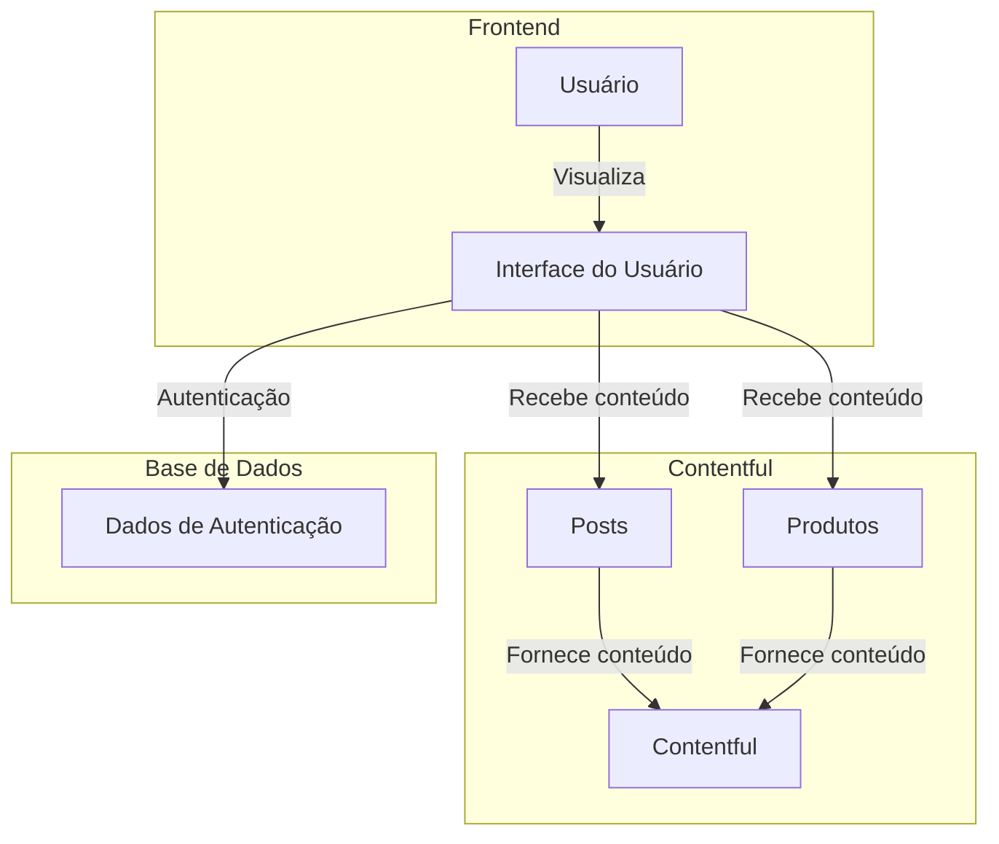

# Especificações do Projeto

Pré-requisitos: <a href="1-Documentação de Contexto.md"> Documentação de Contexto</a>

## Arquitetura e Tecnologias
A arquitetura da aplicação será dividida entre um módulo de frontend e um módulo de backend. Optamos por não adicionar uma aplicação mobile por não julgar necessário ao contexto do cliente. 
O backend da aplicação também se comunicará com um CMS (content management system), que será responsável por armazenar e fornecer dados dos produtos ao backend da aplicação, que por sua vez irá gerenciar os dados recebidos e fornecê-los ao frontend. Além disso, o backend também será responsável pela autenticação de administradores do site, que podem adicionar e remover produtos.
Para o frontend, optamos por utilizar **React, Typescript e Next.js**. No backend, utilizaremos **Typescript, Express** e **MongoDB** como base de dados.
O frontend da aplicação será hospedado na **Vercel** e o backend, no **Fly.io**. O banco de dados será em nuvem, através do **MongoDB Atlas**.

## Project Model Canvas

> O PMC também está disponível neste <a href="https://next.canvanizer.com/canvas/rFO5QtCGUN2x7"> link </a>

## Requisitos

### Requisitos Funcionais

| ID    | Descrição do Requisito                                              | Prioridade |
|-------|---------------------------------------------------------------------|------------|
| RF-001| O site deve exibir os produtos vendidos pela empresa;                | ALTA       |
| RF-002| O site deve exibir informações sobre os produtos, como nome, fabricante e preço; | ALTA |
| RF-003| O site deve permitir a busca de produtos pelo nome ou faixa de preço; | ALTA       |
| RF-004| O site deve conter uma seção com informações sobre a empresa;        | ALTA       |
| RF-005| O site deve conter uma seção de contato, onde os usuários possam realizar os pedidos diretamente com o vendedor; | ALTA |
| RF-006| O site deve apresentar uma seção de feedbacks e permitir o envio de feedbacks dos clientes; | ALTA |
| RF-007| O site deve incluir uma seção de blog com artigos postados regularmente sobre tópicos relacionados à culinária; | ALTA |
| RF-008| Para comentar nos artigos do blog, os usuários devem se registrar e fazer login em suas contas; | ALTA |
| RF-009| Os usuários registrados devem ter a capacidade de editar as informações de sua conta, incluindo nome, endereço de entrega e informações de contato; | ALTA |
| RF-010| Os usuários registrados também devem ter a opção de excluir suas contas, se desejarem; | ALTA |
| RF-011| O site deve incluir uma seção dedicada de Perguntas Frequentes (FAQ) onde os usuários possam encontrar respostas para dúvidas comuns relacionadas a produtos, pedidos, políticas de envio, entre outros; | MÉDIA |
| RF-012| O site deve incluir botões de compartilhamento para permitir que os usuários compartilhem produtos específicos ou artigos do blog em suas redes sociais; | MÉDIA |
| RF-013| O site deve oferecer a opção para os usuários se inscreverem em notificações sobre novos produtos. | BAIXA      |

### Requisitos não Funcionais

| ID    | Descrição do Requisito                                                         | Prioridade |
|-------|-------------------------------------------------------------------------------------|------------|
| RF-014| A aplicação deve ser acessível, de acordo com as métricas da extensão Lighthouse;    | ALTA       |
| RF-015| A aplicação deve atender as métricas de SEO da extensão Lighthouse, para atingir o público-alvo; | ALTA |
| RF-016| A aplicação deve contar com um sistema PWA, para atender aos clientes que preferem uma experiência similar a de aplicativos; | ALTA |
| RF-017| A linguagem em que a aplicação será desenvolvida deve ser Typescript;               | ALTA       |
| RF-018| A aplicação deve ser otimizada para ter um desempenho rápido e responsivo;         | ALTA       |
| RF-019| O site deve apresentar as informações de forma clara e concisa.                   | ALTA       |

## Restrições

O projeto está restrito pelos itens apresentados na tabela a seguir.

|ID| Restrição                                             |
|--|-------------------------------------------------------|
|01| O projeto deverá ser entregue até o final do semestre |
|02| Somente administradores podem realizar login na aplicação        |

## Diagrama de Casos de Uso

Temos dois casos de uso principais para o site, com dois atores distintos: usuário comum e administrador.
### Usuário

### Administrador

## Modelo ER (Projeto Conceitual)

O Modelo ER representa através de um diagrama como as entidades (coisas, objetos) se relacionam entre si na aplicação interativa.

Sugestão de ferramentas para geração deste artefato: LucidChart e Draw.io.

A referência abaixo irá auxiliá-lo na geração do artefato “Modelo ER”.

> - [Como fazer um diagrama entidade relacionamento | Lucidchart](https://www.lucidchart.com/pages/pt/como-fazer-um-diagrama-entidade-relacionamento)

## Projeto da Base de Dados

O projeto da base de dados corresponde à representação das entidades e relacionamentos identificadas no Modelo ER, no formato de tabelas, com colunas e chaves primárias/estrangeiras necessárias para representar corretamente as restrições de integridade.
